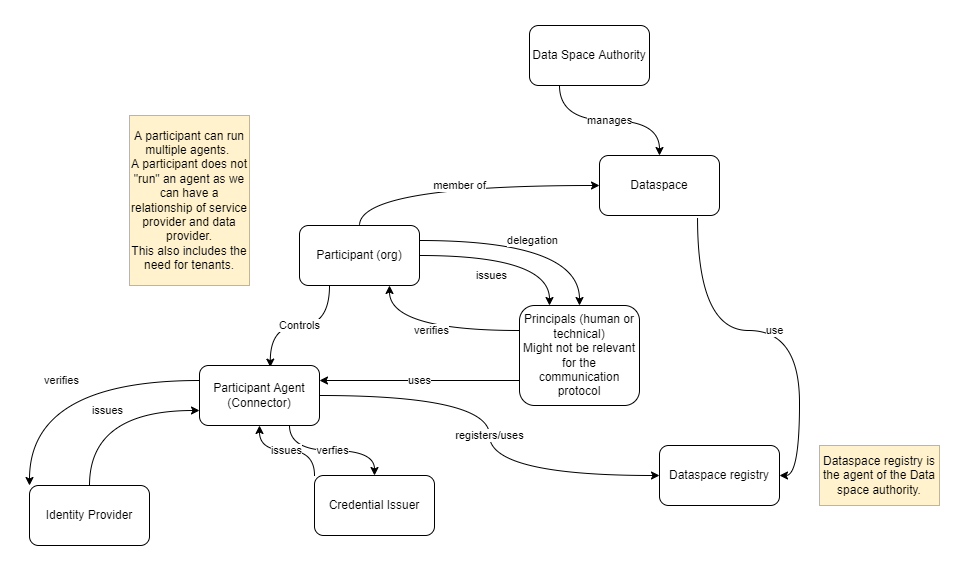

# IDS Communication Guide #

## Introduction ##

Interoperability is a major goal of the IDS. Therefore, the interoperability between IDS Connectors and other components is of high importance. The IDS Communication Guide shall provide the required data structure and the interaction sequences to be realized for interoperability and to be used for interoperability testing.

The Communication Guide is organized into a modular and composable structure.

## Terms and Definitions ##

### Control Plane vs. Data Plane and in-band vs. out of band ###

Joint understanding of the terms `in-band` and `out-of-band`, as well as the `control plane` and `data plane`:

**Commonalities:** Both term pairs…

- represent the split of a previously joint, combined flow of information into two separate parts
- have a background in technology
- have some overlap, but put different emphasis

#### in-band/out-of-band ####

- **origins:** selection of radio frequencies (“bands”) for primary/secondary communication
- the split is motivated mainly by isolation & break-out reasons
- `in-band`: the same `frequency`, `connection` or `means of communication` is used for all transfers
- `out-of-band`: for a selected subset of communication, a different, dedicated band is selected
- **example:** main process is using HTTP, user identity verification subprocess uses SMTP (email)

#### control plane/data plane ####

- **origins:** in a networking device…
- the `control plane` is optimized for customizability and security. it controls the data plane.
- the `data plane` is optimized for speed, throughput and bandwidth. it handles the data payloads.
- the split is motivated mainly by “separation of concerns”
- `control plane`: controls what happens on the data plane
- `data plane`: agnostic of control logic, only used for payload transfers

## Foundation ##

The foundation package contains elements that commonly used. This includes standards that are used as foundation for the Communication Guide.

### Foundational standards ###

[The Foundational Standards list.](./FoundationalStandards/README.md)

### Information Model ###

The common information model that is used in every other package. This shall include a base model containing the entities of a data space and their relation.

(find the source file of the image above [here](./images/CommunicatoinGuide_Dataspace_entities.drawio))

The realization bases on DCAT for the Data Products and ODRL for Contract Policies.

[The IDS-Information Model is here.](./Infomodel/README.md)

### Identities ###

messages and data types:
protocols: state machines for message flows and interaction patterns:
API binding:

### Trust Frameworks ###

messages and data types:
protocols: state machines for message flows and interaction patterns:
API binding:

### Policies (authorization and Policy Description) ###

messages and data types:
protocols: state machines for message flows and interaction patterns:
API binding:

## Data Sharing (Conector) ##

### Contract Negotiation ###

part of the control plane

messages and data types:
protocols: state machines for message flows and interaction patterns:
API binding:

### Data Transfer ###

part of the data plane. How data is exchanged with focus on communication and not on how the data plane is built.

messages and data types:
protocols: state machines for message flows and interaction patterns:
API binding:

## Catalog (Publish and query meta-data) ##

messages and data types:
protocols: state machines for message flows and interaction patterns:
API binding:

## Registration ##

messages and data types:
protocols: state machines for message flows and interaction patterns:
API binding:

## Audit logging ##

currently out of scope

## Vocabularies ##

currently out of scope
