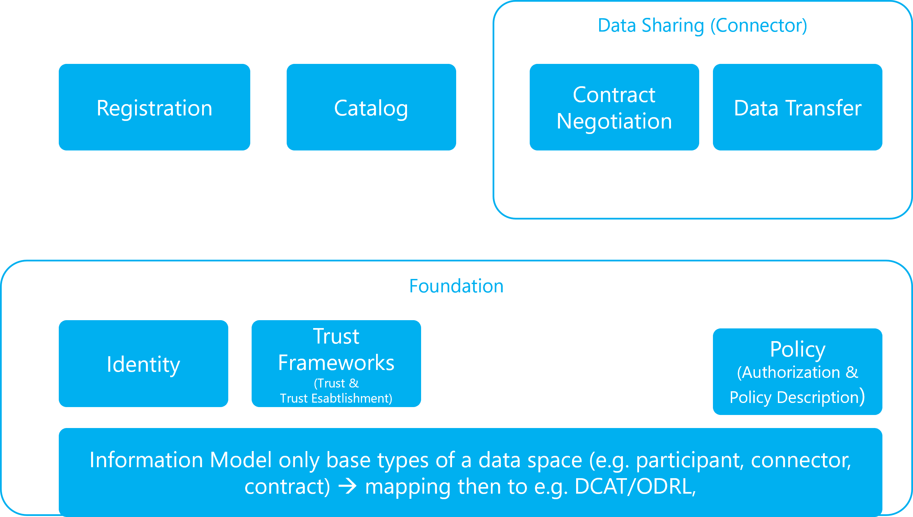
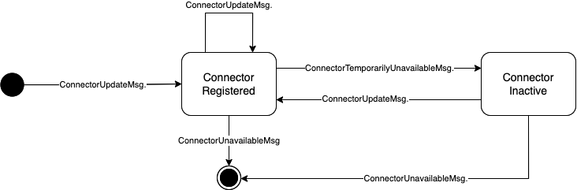
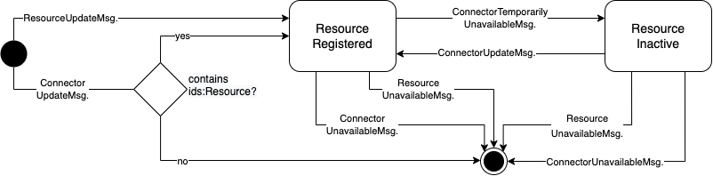

# IDS Communication Guide #

## Introduction ##

This section is non normative.

Interoperability is a major goal of the IDS. Therefore, the interoperability between IDS Connectors and other components is of high importance. The IDS Communication Guide shall provide the required data structure and the interaction sequences to be realized for interoperability and to be used for interoperability testing.

The Communication Guide is organized into a modular and composable structure.

### Aims of the Communication Guide ###

tbd

### Conformance ###

tbd

### Structure of the document ###

The remainder of the document is structures as follows:

- Terms and Definitions
- The foundation package contains the reusable structures and definitions:
  - the basic strucutre of elements and their relationship (information model)
  - standards that are used in the document
  - a definition of digital identities and their interactions
  - a definition of policies
  - Trust Frameworks as a foundation to establish trust in a data space
- Data Sharing
  - Contract negotiation sequence
  - Data Transfer
- Catalog
- Registration to a data space
- Audit Logging and observability (currently out of scope)
- Use of vocabularies (currently out of scope)

The [Bibliography](./notes/bibliography.md) contains links to relevant standards referenced by the above documents.

## Terms and Definitions ##

Most important terms and definition are in the [Glossary](../Glossary/README.md)

### Control Plane vs. Data Plane and in-band vs. out of band ###

Joint understanding of the terms `in-band` and `out-of-band`, as well as the `control plane` and `data plane`:

**Commonalities:** Both term pairs…

- represent the split of a previously joint, combined flow of information into two separate parts
- have a background in technology
- have some overlap, but put different emphasis

#### in-band/out-of-band ####

- **origins:** selection of radio frequencies (“bands”) for primary/secondary communication
- the split is motivated mainly by isolation & break-out reasons
- `in-band`: the same `frequency`, `connection` or `means of communication` is used for all transfers
- `out-of-band`: for a selected subset of communication, a different, dedicated band is selected
- **example:** main process is using HTTP, user identity verification subprocess uses SMTP (email)

#### control plane/data plane ####

- **origins:** in a networking device…
- the `control plane` is optimized for customizability and security. it controls the data plane.
- the `data plane` is optimized for speed, throughput and bandwidth. it handles the data payloads.
- the split is motivated mainly by “separation of concerns”
- `control plane`: controls what happens on the data plane
- `data plane`: agnostic of control logic, only used for payload transfers

#### General remarks on transactions and synchronized states ###

**We should explain briefly on the requirements of state management and how we deal witt it in the remainder of the document.**

## Foundation ##

The foundation package contains elements that commonly used. This includes standards that are used as foundation for the Communication Guide.

### Foundational standards ###

[The Foundational Standards list.](./FoundationalStandards/README.md)

### Information Model ###

The [Information Model document](./model/information.model.md) defines the core concepts, entities, and relationships that underpin a `Dataspace`.

[The IDS-Information Model is the declarative model --> the Binding of the model above to rdf](./Infomodel/README.md)

The general message structure is described [here](./Message-Structure/README.md).

And the message types are listed [here](./Message-Types/README.md).

And messages are part of the [IDS Infomodel](./Infomodel/Message/README.md).

### Identities ###

[This section](./Identities/README.md)

While the API binding is [here](../Components/IdentityProvider/README.md).

### Trust Frameworks ###

[This section](./TrustFrameworks/README.md)

### Policies (authorization and Policy Description) ###

Policies in this context are the IDS Usage Contracts that are defined [here](../UsageControl/Contract/README.md)

## Data Sharing (Connector) ##

Data Sharing and the interaction between connectors focus on Contract Negotiation and Data Transfer

### Contract Negotiation ###

[This section](./ContractNegotiation/README.md)

### Data Transfer ###

part of the data plane. How data is exchanged with focus on communication and not on how the data plane is built.

Bindings for the data exchange are described in the [protocols section](./protocols/README.md).

- [IDS-REST](./protocols/ids-rest/README.md)
- [Multipart](./protocols/multipart/README.md)
- [IDSCP V2](./protocols/idscp2/README.md)

## Catalog (Publish and query meta-data) ##

**This section mixes old and new please review**

The catalog in the IDS is a collection of Self-Descriptions, either of IDS Connectors or IDS Resources published by such IDS Connectors. The Self-Descriptions are the first-class-citizen in the catalogs, therefore all messages have the Self-Descriptions as their target, instead of the catalogs containing them.

The [Catalog Protocol document](./catalog/catalog.protocol.md) defines a how a `Catalog` is requested from a catalog service by a consumer using an abstract message exchange format.

The [Catalog Binding document](./catalog/catalog.binding.https.md) defines a RESTful API over HTTPS for the `Catalog Protocol`.

### Messages and Datatypes

The messages, expected content, and the error behaviour are described in the [Functions and Correlated Messages](../Components/MetaDataBroker/FunctionsAndCorrelatedMessages/) section of the Metadata Broker.

### Interaction Sequences
<!--state machines for message flows and interaction patterns:-->
Creating and manipulating catalog entries follows different state transitions depending wether Connector or Resource self-descriptions are concerned.

#### Register and Update a Connector Self-Description

An IDS Connector self-description is either unknown to a catalog (`initial state`), registered (`ConnectorRegistered`), temporarily inactive (`ConnectorInactive`), or deleted from the catalog (`end state`) as shown in Fig. C1. An inactive self-description is intended for Connectors, which are currently not reachable but intend to become active again in the dataspace. A Connector which self-description has been deleted before (aka. has reached the `end state`) must never come back with the same URI identifier. This is to prevent *false-flag operations* where evil players claim the identity of removed Connectors.

___Figure C1: State transitions of Connector self-descriptions in a catalog.___

#### Retrieve a Connector Self-Description

Fig. C2 shows the diagram how to request a Connector self-description entry from a catalog. The DescriptionRequestMessage contains a reference to the target Connector self-discription identifier, defining which catalog entry shall be returned. There is no intermediate state so the operation is either successful or fails, for instance, due to a non-existing entry or an incorrectly formatted message.

___Figure C2: Requesting a Connector self-description has no further states apart of the standard success or error cases.___

#### Register and Update a Resource Self-Description

An IDS Resource is either unknown to a catalog (`initial state`), registered (`ResourceRegistered`), temporarily inactive (`ResourceInactive`), or deleted from the catalog (`end state`) as shown in Fig. C3. It may be automatically created if a Connector self-description is added or extended (ConnectorUpdateMessage) and its self-description also contains Resource entries. A Resource self-description becomes inactive - and active again - if its parent Connector catalog entry becomes inactive or active. Similarily, a Resource self-description gets deleted automatically if the containing Connector gets deleted through a ConnectorUnavailableMessage.

___Figure C3: State transitions of Connector self-descriptions in a catalog.___

#### Rerieve a Resource Self-Description

Fig. C4 shows the diagram how to request a Resource entry from a catalog, similar to the operation for a Connector self-description. The DescriptionRequestMessage contains a reference to the target Resource self-discription identifier, defining which catalog entry shall be returned. There is no intermediate state so the operation is either successful or fails, for instance, due to a non-existing entry or an incorrectly formatted message.

___Figure C4: Requesting a Resource self-description has no further states apart of the standard success or error cases.___

#### Query a Catalog

Fig. C5 shows the diagram how to send a formulated query a catalog. Different to the retrieval of Connector or Resource self-description entries, the return format is not predefined but depends on the query. The QueryMessage contains formulated query string in a standardized query language, for instance, SPARQL or the upcoming GQL. There is no intermediate state so the operation is either successful or fails, for instance, if the query language is not supported by the catalog hoster or the query itself contains syntax errors.

___Figure C5: Sending a catalog query has no further states apart of the standard success or error cases.___

### API Bindings

The API Operations of catalogs in the different protocol bindings are explained in the respective protocol sections:
* [IDS REST](./protocols/ids-rest/README.md#complex-operations-and-workflows)
* [IDS Multipart](./protocols/multipart/README.md#41-metadata-broker-communication)
* [idscp2](./protocols/idscp2/ApplicationLayer/README.md)

## Registration ##

[This section](./Registration/README.md)

## Audit logging ##

currently out of scope

## Vocabularies ##

currently out of scope
