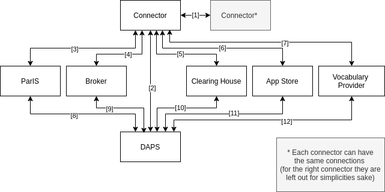
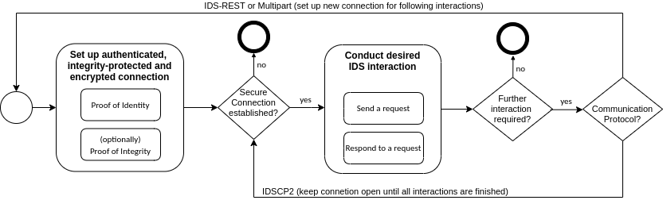

# Overview #

| ID   | Sequence Specification | Protocols |
|:-----|:---| :--- |
| [1]  | [Connector to Connector](./sequence-diagrams/data-connector-to-data-connector#message-flows-for-connector-to-connector-communication) | [Multipart](./protocols/multipart); [IDS-REST protocol](./protocols/ids-rest); [IDSCP2 Transport Layer Protocol](./protocols/idscp2/TransportLayer); [IDSCP2 Application Layer protocol](./protocols/idscp2/ApplicationLayer) |
| [2]  | Connector to Dynamic Attribute Provisioning Service (DAPS) |  |
| [3]  | Connector to Participant Information Service (ParIS) |  |
| [4]  | Connector to [Metadata Broker](./sequence-diagrams/data-connector-to-metadata-broker) | [Multipart](./protocols/multipart) |
| [5]  | [Connector to Clearing House](./sequence-diagrams/data-connector-to-clearing-house) | [Multipart](./protocols/multipart) |
| [6]  | Connector to App Store |  |
| [7]  | Connector to Vocabulary Provider |  |
| [8]  | ParIS to DAPS |  |
| [9]  | Broker to DAPS |  |
| [10] | Clearing House to DAPS |  |
| [11] | App Store to DAPS |  |
| [12] | Vocabulary Provider to DAPS |  |

Since all IDS components are, at their core, a Connector, the connection of these to the DAPS (sequence 8-12) is designed in the same way as that of the Connector to the DAPS.

## General Component Interaction ##

In general, each communication between two components includes the following building blocks:
  

Every communication requires an authenticated, integrity-protected and encrypted connection. The verification of the connector's identity is based on the IDS identity certificate (X.509v3), dynamic attributes and details for the company operating the connector. Additionally, connectors in the Trust or Trust+ Level need to prove their integrity with Remote Attestation based on a transmitted Attestation Report. Based on the secure channel, the desired IDS interaction is conducted as described in the Sequence Specifications above. If no secure channel can be established, the IDS interaction must not be executed.

After the IDS Message was handled, the process/communication channel is terminated if no further interaction is required. Otherwise, the behavior depends on the utilized communication protocol. For a communication with the [IDS-REST protocol](./protocols/ids-rest) or [Multipart](./protocols/multipart), the communication channel will be re-established for every IDS Message. With the IDSCP2, the communication channel is established once via the [IDSCP2 Transport Layer Protocol](./protocols/idscp2/TransportLayer) and all IDS interactions will be executed via this channel with the [IDSCP2 Application Layer protocol](./protocols/idscp2/ApplicationLayer).

## Communication Guide ##

The specification of the Commmunication in IDS is descibed in the [IDS Communication Guide](./CommunicationGuide.md).
