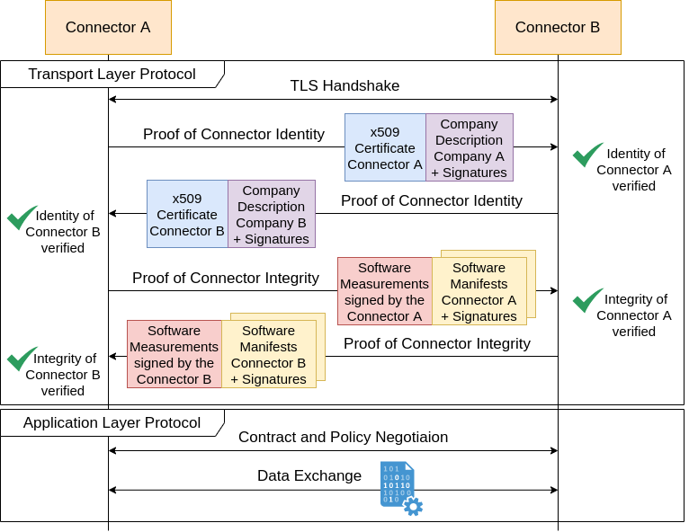

# IDS Communication Protocol Version 2 (IDSCP2)

The IDSCP2 communication protocol is used as a stateful protocol for the IDS Message flow.
It consists of a Transport Layer protocol responsible for setting up a secure communication channel and an Application Layer protocol for exchanging IDS Messages.

The general flow of the communication protocol is shown in the following sequence diagram:

As the basis for the communication, the [IDSCP2 Transport Layer](./TransportLayer/README.md) is responsible for setting up a mutual authenticated, encrypted and integrity protected communication channel. It builds on TLS and verifies the identity and integrity of the communication partners before allowing further communication.
Afterwards, the [IDSCP2 Application Layer](./ApplicationLayer/README.md) is used to communicate via the established communication channel and takes care of the negotiation of contracts and the exchange of data.
