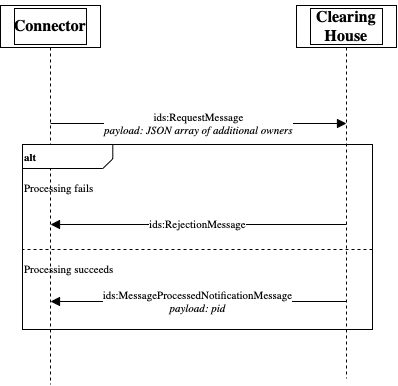
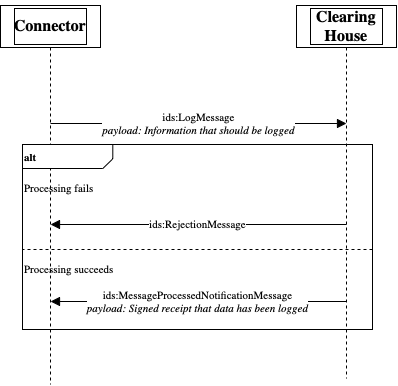
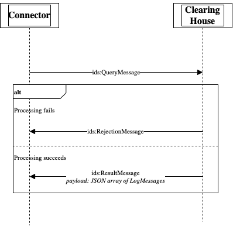
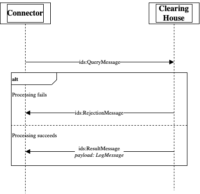

# Message Flows for Connector to Clearing House Communication

## Creating a Process
The IDS Clearing House structures its logs into processes and requires that all messages are logged under a process id. Processes are meant to represent agreed upon data exchanges that include the storage of the contract agreement and all messages that document the data exchange. Processes can be created by any IDS connector with a valid DAT, who becomes the owner of the process. Only the owner of the process may read or write data in the process.

The optional payload contains a list of connectors that should be owner of the process and allowed read and write access to the process. Connectors are identified by their unique identifiers.

## Logging messages to a process
The information that should be logged in the Clearing House is sent in the payload of a [LogMessage](https://github.com/International-Data-Spaces-Association/IDS-G-pre/tree/connector-interaction/Communication/Message-Structure). The log entry stored in the Clearing House consists of the payload and meta-data from the [LogMessage](https://github.com/International-Data-Spaces-Association/IDS-G-pre/tree/connector-interaction/Communication/Message-Structure). Messages can either be sent to an existing process or a non-existing process, in which case the Clearing House will create a new process. But processes created this way are only accessible by the connector for which they were created.

The payload of the response contains a signed receipt of the logged data in form of a JSON Web Token (JWT).

## Query all messages of a process
Retrieves all log entries that are stored for a process in the Clearing House. The Clearing House answers the request with a [ResultMessage](https://github.com/International-Data-Spaces-Association/IDS-G-pre/tree/connector-interaction/Communication/Message-Structure) that contains as the payload all log entries found. Each log entry is returned as a [LogMessage](https://github.com/International-Data-Spaces-Association/IDS-G-pre/tree/connector-interaction/Communication/Message-Structure), i.e., the payload of the [ResultMessage](https://github.com/International-Data-Spaces-Association/IDS-G-pre/tree/connector-interaction/Communication/Message-Structure) contains a `json` array of [LogMessage](https://github.com/International-Data-Spaces-Association/IDS-G-pre/tree/connector-interaction/Communication/Message-Structure).

## Query a single message of a process
Retrieves a specific log entry from the Clearing House. The Clearing House answers the request with a [ResultMessage](https://github.com/International-Data-Spaces-Association/IDS-G-pre/tree/connector-interaction/Communication/Message-Structure) that contains as the payload the log entry found. The log entry is returned as a [LogMessage](https://github.com/International-Data-Spaces-Association/IDS-G-pre/tree/connector-interaction/Communication/Message-Structure), i.e., the payload of the [ResultMessage](https://github.com/International-Data-Spaces-Association/IDS-G-pre/tree/connector-interaction/Communication/Message-Structure) contains a [LogMessage](https://github.com/International-Data-Spaces-Association/IDS-G-pre/tree/connector-interaction/Communication/Message-Structure).

