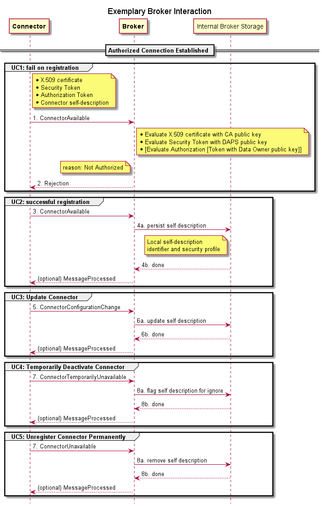
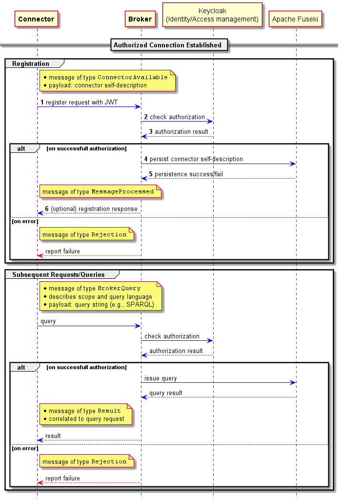

# IDS Metadata Broker Communication

---

## Message Flows for Connector to Metadata Broker Communication

-  *[Publication](#Publication)* of an exemplary Broker self-description document,
-  *[Registering](#Registering)*, Unregistering and Updating a Connector at the Broker,
-   *[Querying](#Querying)* the content of the Broker, i.e., the registered self-description documents.
-   *[Full-text, faceted Search](#Search)* on registered Broker self-descriptions (optional).

***Figure 1: Interaction sequences with a Metadata Broker***

## Publication

The Metadata Broker, as any other IDS Connector, publishes a Self-Description that can be requested by Connectors:

*Implementations:*

|  List of Implementations |
|---|
| [IDS-REST](../../protocols/ids-rest/README.md#DescriptionRequestMessage) |
| [idscp2](../protocols/idscp2/ApplicationLayer/README.md) |
| [multipart](../../protocols/multipart/README.md#415-Connector-Update) |

## Registering

Both IDS Connector and IDS Resource Self-Descriptions can be registered at the Metadata Broker. Note that a Metadata Broker must only accept Connector Self-Descriptions if the described Connector is identical with the sender Connector.

*Implementations:*

|  List of Implementations |
|---|
| [IDS-REST (for IDS Connectors)](../../protocols/ids-rest/README.md#ConnectorUpdateMessage) |
| [IDS-REST (for IDS Resources)](../../protocols/ids-rest/README.md#ResourceUpdateMessage) |
| [idscp2](../protocols/idscp2/ApplicationLayer/README.md) |
| [multipart](../../protocols/multipart/README.md#415-Connector-Update) |

## Update

Previously registered Self-Descriptions can be updated at the Metadata Broker. Note that a PUT semantics is used as the default mechanism for updates. This means, that the old Self-Descriptions are completely overwritten by the newly received ones. Similar to registrations, usually Connectors can only update their own Self-Descriptions.

*Implementations:*

|  List of Implementations |
|---|
| [IDS-REST (for IDS Connectors)](../../protocols/ids-rest/README.md#ConnectorUpdateMessage) |
| [IDS-REST (for IDS Resources)](../../protocols/ids-rest/README.md#ResourceUpdateMessage) |
| [idscp2](../protocols/idscp2/ApplicationLayer/README.md) |
| [multipart](../../protocols/multipart/README.md#415-Connector-Update) |

## Unregistering

Previously registered Self-Descriptions can be unregistered at the Metadata Broker.

*Implementations:*

|  List of Implementations |
|---|
| [IDS-REST (for IDS Connectors)](../../protocols/ids-rest/README.md#ConnectorUnavailableMessage) |
| [IDS-REST (for IDS Resources)](../../protocols/ids-rest/README.md#ResourceUnavailableMessage) |
| [idscp2](../protocols/idscp2/ApplicationLayer/README.md) |
| [multipart](../../protocols/multipart/README.md#416-ConnectorUnavailableMessage) |

## Querying

The Metadata Broker provides at least one query endpoint, which is able to handle complex, express queries. The query language of the IDS is SPARQL.

*Implementations:*

|  List of Implementations | Comment |
|---|---|
| [IDS-REST](../../protocols/ids-rest) | The IDS REST Binding does not provide any complex query mechanisms. Instead, it expects that the Client Connector traverse through the offered Web Resources using a series of single requests. See the other Protocol Bindings for query capabilities. |
| [idscp2](../protocols/idscp2/ApplicationLayer/README.md) |
| [multipart](../../protocols/multipart/README.md#418-QueryMessage) |

## Search

A Metadata Broker allows the search through a frontend UI, providing at least full-text and facet search capabilities for human users.

*Implementations:*

| Comment |
|---|
| Full-text, facet, and other kinds of UI-based search is not intended via IDS protocols and therefore appears only on the frontend. The IDS does not make any specifications how such features must be implemented. |

***Figure 2: Exemplary sequence of interactions with a Metadata Broker***
