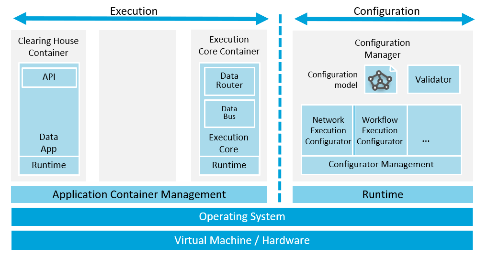

# IDS Clearing House (IDS-CH)

- [Glossary "Clearing House"](../../Glossary/README.md#clearing-house)
- Shortcut: `IDS-CH`

---

# Introduction

The IDS Clearing House acts as an intermediary in the IDS ecosystem. All IDS Connectors may log information in the Clearing House to support any process that requires an auditable logging mechanism. This includes e.g., the following processes in the IDS:
- data sharing between a Data Provider (DP) and a Data Consumer (DC)
- data usage according to Usage Contracts or Data Usage Policies

More information on the Clearing House is provided in [IDSA Clearing House Specification 1.0](https://internationaldataspaces.org/wp-content/uploads/dlm_uploads/IDSA-White-Paper-Specification-IDS-Clearing-House-.pdf)

# IDS Clearing House Architecture
## Overview
The IDS Clearing House is an IDS Connector that runs the Clearing House Container as one of its services. As such, the connector part of the Clearing House is responsible for communication with other IDS Connectors. The architecture follows the IDS Connector architecture as presented in RAM 3.0 (see Section 3.5.1).

## Clearing House API
The IDS Clearing House provides an HTTP API for IDS Connectors to communicate with, i.e. to log and query information. The API is described in detail in [Clearing House Communication](../../Communication/sequence-diagrams/data-connector-to-clearing-house/README.md).

# Data Protection and Integrity
Details on further requirements for the Clearing House, in particular with regards to data protection and integrity, will be added in the future.
