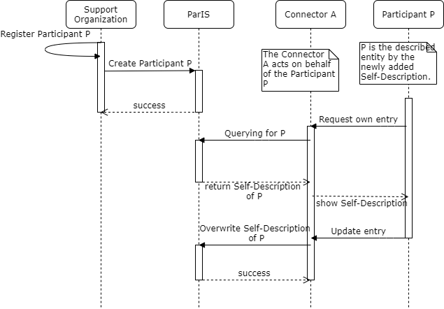
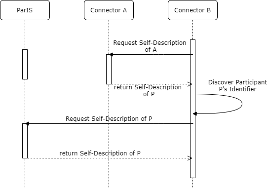

# IDS Participant Information Service (IDS-ParIS)

- Shortcut: `IDS-ParIS`

# Document History

| Date | Change | Author |
| --- | --- | --- |
| 27.07.2021 | integrating the feedback from the review round | [Sebastian Bader](https://github.com/sebbader) |
| 25.06.2021 | rework for first review | [Sebastian Bader](https://github.com/sebbader) |
| 03.03.2021 | Initial version | [Sebastian Bader](https://github.com/sebbader) |

# Authors

| Name | Organization | Email |
| --- | --- | --- |
| [Sebastian Bader](https://github.com/sebbader) | Fraunhofer IAIS | [sebastian.bader@iais.fraunhofer.de](mailto:sebastian.bader@iais.fraunhofer.de) or [contact@ids.fraunhofer.de](mailto:contact@ids.fraunhofer.de) |

# Goals and Scope of the Document

This document describes minimum requested requirements to be met by the IDS Participant Information Service. The ParIS, technically similar to the [IDS MetaData Broker](), provides the interaction mechanisms to publish and query for attributes of IDS Participants. Similar to the [IDS MetaData Broker](), the ParIS is also an [IDS Connector]() and therefore must also comply to all of its certification criteria.

## Purpose of the Document

The document contains the technical specification of the IDS Participant Information Service. It thereby constitutes the basis of the certification criteria that every ParIS instance must fulfill.

## Related Documents

The following public documents are related to this document and should be considered as important:

- [Glossary "ParIS"](../../glossary/README.md#paris)
- IDS-RAM 4.0
- IDS Certification Criteria
- [IDS-G](https://github.com/International-Data-Spaces-Association/IDS-G)

# Introduction

One of the most important value propositions of the IDS is the enablement of business interactions between previously unrelated Participants. That aims in particular at companies that have not met before in the digital or non-digital world but now start business agreements solely relying on the IDS. The therefore necessary trust in the opposite party is technically achieved by a verifiable identity management process through the Identity Provisioning Service and the DAPS. Both components equip each Participant with the necessary attributes and cryptographic proofs for the IDS handshakes.
The establishment of a secure and uncompromised communication channel is however only the necessary requirement for a business interaction. In addition, the respective Participants need to understand their opposite’s state in regards of business workflows. For instance, every business actor needs to know its customers tax identification or VAT number to create correct invoices. Furthermore, the registered address is critical to understand the responsible jurisdiction for the unfortunate cases when only courts can solve conflicts.

# IDS ParIS in Relation to IDS-RAM Layers

The Participant Information Service fits, as any other component in an IDS ecosystem, into the IDS Reference Architecture. The following sections describes its aspects and characteristics in the context of the relevant layers of the IDS Reference Architecture Model.

## Business Layer

The IDS ParIS is part of the IDS Identity Provider, together with the CA and the DAPS. It contains attributes about the Participants as business entities and collects and provides the necessary information in a consistent and uniform manner. Other Participants can query for a business partner's VAT, legal representatives or organizational structure.

Such information is provided and maintained by the Support Organization in an IDS, the legal entity that administers the ecosystem. The Support Organization introduces a new Participant by creating its digital identity and at the same time registers security-critical at the DAPS and business-relevant attributes at the ParIS. The ParIS provides access to these attributes to the other IDS Participants and components and connects the unique Participant identifier – a URI – with additional metadata. Usually, each IDS ecosystem operates only a small number of ParIS instances, usually only one. IDS Participants therefore know the location where to ask for more information about a potential business partner and can decide whether to start a data exchange.

Different to other IDS components, the trustworthiness of ParIS’ provisioned information is not grounded on technical measures, like for instance signatures or certificates, but on the administrative process controlled by the Support Organization. A direct consequence of this process is the necessity that each change request is manually verified before added to the ParIS database.

## Functional Layer

The IDS ParIS enables the Ecosystem of Data (IDS Functional Requirement #3) by bridging the technical infrastructure of an IDS, mainly the administrative capabilities of the supporting organization, with the Connector communication. As such, the ParIS is the enabler for the necessary Standardized Interoperability (IDS Functional Requirement #4) to give access to business-critical information and legal aspects. This creates the basis for Data Markets (IDS Functional Requirement #6).

## Process Layer

In order to fulfill the outline tasks from the Business and Functional Layer, several interaction processes are defined that all ParIS instances need to support. Further interactions depend on the support through the ParIS operators and are in principle allowed, as long as they are properly documented and do not represent any kind of conflict with the following operations.

| Operation |	Description |	Executing Role | Implication |
|:--| -- | -- | -- |
| Create Participant Entry | A new Participant Self-Description is added to the ParIS | Operator of the Identity Provider/Support Organization or the Participant itself | The Participant's Self-Description is visible to the respective IDS ecosystem |
| Update Participant Entry | An attribute of a Participant's Self-Description needs to be changed, new attributes added, or old ones deleted. | Operator of the Identity Provider/Support Organization or the Participant itself | The old Self-Description is completely replaced with the new one. The old Self-Description might be stored for documentary purposes but must not be supplied in the IDS ecosystem. |
| Querying a specific Participant Entry | The requester is interested in one Self-Description of one explicitly identified Participant. | Any IDS Connector that is taking part of the ParIS' data space. | Delivery of the latest version of the Participant Self-Description. |
| Querying over several Participant Self-Descriptions | The requester is interested in a complex fact that for instance involves several Self-Descriptions or otherwise affects filters, joins, or aggregations of Self-Descriptions or their attributes. | Any IDS Connector that is taking part of the ParIS' data space. | Delivery of a result object based on the latest versions of the underlying Self-Descriptions. |

The following UML sequence diagram shows the potential interactions between the different roles in an IDS ecosystem and the ParIS.

_Figure 1: Exemplary interactions to populate a ParIS entry._

_Figure 2: Exemplary interactions to interact with a ParIS._

## Information Layer

The Information Layer affects two aspects of the ParIS. First, it defines the attributes and values that can be used in a Participant Self-Description and therefore appear at the ParIS. Second, the Information Model also defines the component itself - using the class `ids:ParIS` - and the interaction methods, in particular the applicable IDS Message Types. The details of the applicable IDS messages are further explained in the Section about the System Layer.

## Data Model, Participant and Participant Attributes
The attributes provided by the ParIS are in general not critical for the security aspects of the IDS but highly relevant for every business interaction. While for instance IDS handshakes can be executed without knowing the physical location of the opposite party, business processes need to know about the respective country and tax regulations, or which is the complete, legally valid name to create a proper invoice.
Other information however is critical to evaluate the identity of the opposite party. These attributes, for instance `ids:referringConnector` that give the identity of the Connector and thereby an - indirect - link to the Participant Identifier through the Connector's Self-Description. The Participant Identifier is always an URI, preferably pointing also to a Self-Description document for this participant entity. In any case, the description of the Participant should be available at the ParIS, giving Connectors the technical means to resolve a Participant URI.
Table 1 contains the currently defined properties of an IDS Participant that can be used to model the metadata for a ParIS. The described properties represent the minimal set of attributes each ParIS implementation must accept. Nevertheless, specialized implementations may also accept and provide additional properties, dependent on the domain-specific requirements or its technical capabilities.

| Attribute |	Datatype/Target Class |	Description |
|:--| -- | -- |
| [gr:legalName](http://purl.org/goodrelations/v1#legalName)	| [xsd:string](http://www.w3.org/2001/XMLSchema#string)	| The complete legal name of the IDS Participant, for instance 'International Data Spaces e. V.' is the legal name for the IDSA.|
| [gr:name](http://purl.org/goodrelations/v1#name)	| [xsd:string](http://www.w3.org/2001/XMLSchema#string)	| The commonly used name or term for the IDS Participant, for instance ‘IDSA’ for the legal entity ‘International Data Spaces e. V.’ |
| [ids:corporateEmailAddress](https://w3id.org/idsa/core/corporateEmailAddress)	|	[xsd:string](http://www.w3.org/2001/XMLSchema#string)	|	Email address for contacting the participant on a general level.	|
| [ids:corporateHomepage](https://w3id.org/idsa/core/corporateHomepage)	|	[xsd:anyURI](http://www.w3.org/2001/XMLSchema#anyURI)	|	General official homepage of the participant.	|
| [ids:memberParticipant](https://w3id.org/idsa/core/memberParticipant)	|	[ids:Participant](https://w3id.org/idsa/core/Participant)	|	Indicates that a participant has a member which is again a participant. This is useful for defining hierarchical relations in a participant's organization as well as identifying groups of participants to capture, e.g., members of a collaboration.	|
| [ids:participantRefinement](https://w3id.org/idsa/core/participantRefinement)	|	[ids:AbstractConstraint](https://w3id.org/idsa/core/AbstractConstraint)	|	Conditions which needs to be satisfied that a single Participant can be seen as a member of the subject Participant. For instance, all Participants with their headquarter in Europe might be a potential consumer of GDPR-releated data.	|
| [ids:memberPerson](https://w3id.org/idsa/core/memberPerson)	|	[ids:Person](https://w3id.org/idsa/core/Person)	|	Indicates membership of a person to an organization.	|
| [ids:participantCertification](https://w3id.org/idsa/core/participantCertification)	| [ids:ParticipantCertification](https://w3id.org/idsa/core/ParticipantCertification) | 	Certification issued for the given Participant.
| [ids:primarySite](https://w3id.org/idsa/core/primarySite)	|	[ids:Site](https://w3id.org/idsa/core/Site)	|	Indicates a primary site for the Organization, this is the default means by which an Organization can be contacted and is not necessarily the formal headquarters.	|
| [gr:vatID](http://purl.org/goodrelations/v1#vatID)	| [xsd:string](http://www.w3.org/2001/XMLSchema#string)	|	The Value-added Tax ID of the IDS Participant. See http://en.wikipedia.org/wiki/Value_added_tax_identification_number for details.
| [gr:taxID](http://purl.org/goodrelations/v1#taxID)	| [xsd:string](http://www.w3.org/2001/XMLSchema#string)	|	The Tax / Fiscal ID of the IDS Participant, e.g. the TIN in the US or the CIF/NIF in Spain. It is usually assigned by the country of residence.	|
| [ids:registryCourt](https://w3id.org/idsa/core/registryCourt)	| [xsd:string](http://www.w3.org/2001/XMLSchema#string)	|	The responsible court for the organization. Usually a city and country.	|
| [ids:legalForm](https://w3id.org/idsa/core/legalForm)	|	[xsd:string](http://www.w3.org/2001/XMLSchema#string)	|	The legal form of the IDS Participant.	|
| [ids:hasRole](https://w3id.org/idsa/core/hasRole)	|	[xsd:anyURI](http://www.w3.org/2001/XMLSchema#anyURI)	|	The internal organizational roles that the Participant wants to announce to business partners in order to restrict data usage. For instance, if the organization has dedicated “risk managers”, Data Providers can state that only users with this role can see the IDS Resource. A role must be encoded with a valid, unambiguous URI, for instance https://<company-domain/role#<role-name>.	|

_Table 1: Attributes of an IDS Participant instance_

## System Layer

The internal architecture of the ParIS is in the responsibility of its operator and is not further regulated. Nevertheless, as also the ParIS appears as an IDS Connector, all requirements applicable to a Connector also apply to a ParIS. It is furthermore relevant to note, that more than one ParIS instance can be active in any IDS ecosystem. Even if that is the case, the single ParIS instances are not obliged to synchronize their content nor to announce the existence of the other instances to incoming requests.

### Technical Workflow and IDS interactions

The initial population of a Participant entry is conducted directly after the certification and identity creation process is finished. The Support Organization is informed about the successful steps and provided with the corresponding metadata about the new entity (cf. Tab. 1). The provisioning of this information is not part of the IDS interactions yet and must be managed through traditional communication measures. The Support Organization verifies the correctness of the claims, verifies the information, and – together with other additional steps – equips the dedicated ParIS with the new IDS Participant instance. It is further recommended that each Participant also hosts this self-description on a publicly accessible HTTP server of its choice. Preferably the locator of this self-description document, a HTTP URL, is identical with the used Participant URI. This best practice enables the lookup or dereferencing of the Participant Identifier through every HTTP client and thereby eases the discovery of relevant information. Nevertheless, in case the own supplied Participant self-description and the metadata at the ParIS deviate, the latter is more trusted as its claims have been verified through the Support Organization beforehand.
Requests to the ParIS itself follow the IDS Message Model and are described, among others, in the IDS Communication Guide and the IDS Information Model. The most common call, the request for a description of an identified IDS Participant, is executed using the ids:DescriptionRequestMessage with the Participant Identifier at the ids:requestedElement attribute. The response message contains a JSON-LD representation of the Participant instance or returns an error message in case the requested identifier is not known to the server.

| Operation |	Message Type |	Content | Response |
|:--| -- | -- | -- |
| Create Participant Entry | ParticipantUpdateMessage | Instance of the IDS Participant class. | MessageProcessedNotification or RejectionMessage with an explanation in English language |
| Update Participant Entry | ParticipantUpdateMessage | Instance of the updated IDS Participant class with all attributes, also the one that shall not be changed. | MessageProcessedNotification or RejectionMessage with an explanation in English language |
| Querying a specific Participant Entry | DescriptionRequestMessage | Target resource contains the URI of the Participant. | DescriptionResponseMessage with the Participant Self-Description or RejectionMessage with an explanation in English language |
| Querying over several Participant Self-Descriptions | QueryMessage | SPARQL query formulating the information request | QueryResponseMessage or RejectionMessage with an explanation in English language. |

_Table 2: ParIS Operations and their respective IDS Messages._

### Protocol Bindings

Every ParIS must support at least one of the defined IDS protocols, for instance Multipart, IDS-REST or IDSCP2. Every supported protocol binding must be announced in the Self-Description of the ParIS, which is published in the common IDS manners.

# Future Developments

The IDS ParIS is an infrastructure component in the IDS general architecture with a similar functionality as the IDS Metadata Broker. While the latter indexes Data Resources and Connectors, the ParIS makes Participant information available. Further extensions of its specification may include a more fain-grained access and update model. That can contain the ability for each Participant to update non-critical attributes of its own description, for instance the corporate email address or the member persons. Other attributes, like for instance the VAT number or the legal name, will still require a verification process through the Support Organization. Realizing such options will enable a faster and more accurate provisioning of descriptive metadata while the trust level for critical attributes stays the same. The IDSA Working Group Architecture structures these activities and prepares the further development of the ParIS specification.

# Normative References

## Namespace Prefixes

| Prefix | Namespace |
|:--| --- |
| ids | https://w3id.org/idsa/core/ |
| gr | http://purl.org/goodrelations/v1# |
| xsd | http://www.w3.org/2001/XMLSchema# |

# Non-normative References

- [IDS Communication Guide](https://industrialdataspace.jiveon.com/docs/DOC-2524)
- [IDS Handshake](https://industrialdataspace.jiveon.com/docs/DOC-1817)
- [Usage Control in the IDS](https://internationaldataspaces.org/download/21053/)
- [ParIS Reference Implementation](https://github.com/International-Data-Spaces-Association/ParIS-open-core)
