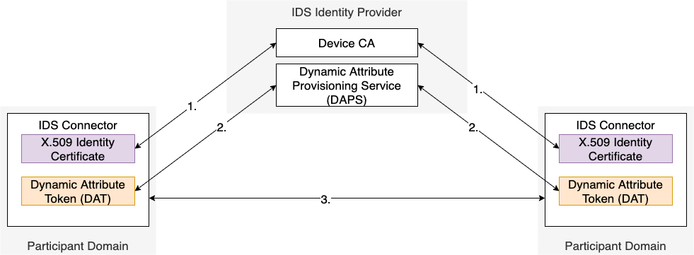

# IDS Identity Provider

The IDS Identity Provider consists of the following components:
- [Certificate Authority (CA)](CA/README.md)
- [Dynamic Attribute Provisioning Service (DAPS)](DAPS/README.md)
- [Participant Information System (ParIS)](ParIS/README.md)

To establish a trusted connection, each connector needs the identity information of the corresponding connector to perform access and usage control decisions. The interactions can be depicted as follows:

#### _Figure 4.1.2.3: Interaction between IDS Connectors and Identity Components_

1. Each IDS Connector acquires a valid identity certificate from the IDS Device CA.
2. Each IDS Connector requests a current Dynamic Attibute Token from DAPS.
3. When establishing communication, the DATs of both IDS Connector instances is exchanged. This is also matched with the used TLS certificate.

To avoid the possibility of abusing a DAT by an attacker, these DATs must be treated as confidential information. This information is only disclosed to other communication partners at will. To further protect from attacks performed with leaked DATs, each Connector has to validate the presented certificate by matching it to the connectors identifier. The ParIS only serves untrusted information and thus is not part of this interaction. The DAT will be refreshed on a regular basis, since the token lifetime is limited to a short timeframe. The device identity will be provisioned and refreshed only after expiration (with a long time frame) or in case of revocation. 

Two cases must be evaluated:

1. The connector uses its identity certificate for TLS connections. In this case, the corresponding IDS connector must assure the identifier in the DAT matches the presented certificate.
2. The connector uses a separate certificate for TLS connections (e.g., issued by a CA such as Let's Encrypt). In this case, the corresponding IDS Connector must assure the certificate fingerprint matches the one that is embedded in the DAT. This is done by linking the identity certificate to the transport certificates via the DAT. 

Connector identities are discussed in [Connector identities](Connector_Identities.md).