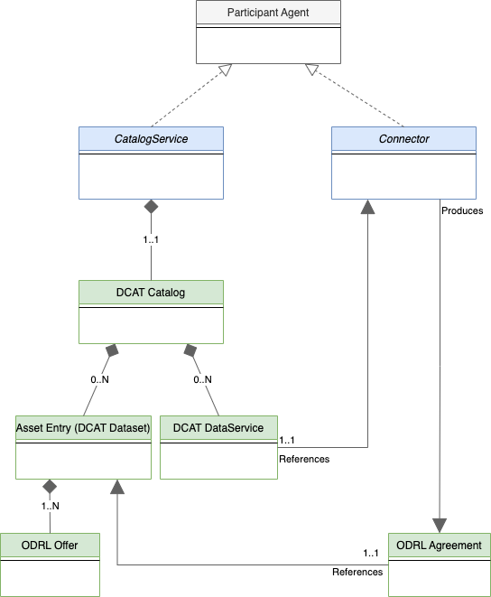

# Dataspace Information Model

The information model defines the core concepts, entities, and relationships that underpin a `Dataspace`.

## 1 Terminology

### Dataspace

A `Dataspace` is a set of technical services that facilitate interoperable asset sharing between entities.

### DataspaceAuthority

A `DataspaceAuthority` is an entity that manages a `Dataspace`.

### Participant

A `Participant` is a `Dataspace` member that provides and/or consumes assets.

### ParticipantAgent

A `ParticipantAgent` is a technology system that performs operations on behalf of a `Participant`.

### IdentityProvider

An `IdentityProvider` is a trusted technology system that creates, maintains, and manages identity information for a `Participant` and `ParticipantAgents`.

### CredentialIssuer

A `CredentialIssuer` is a trusted technology system that issues verifiable credentials for a `Participant` and `ParticipantAgents`.

### ClearingHouse (TBD)

A `ClearingHouse` is a trusted technology system that records and verifies domain events.

### DataspaceRegistrationService

A `DataspaceRegistrationService` is a technology system that maintains the state of `Participants` in a `Dataspace`.

### Asset

Data or a technical service that can be shared by a `Participant`.

### Policy

A set of rules, duties, and obligations that define the terms of use for an `Asset`.

### Offer

A concrete `Policy` associated with a specific `Asset`.

### Agreement

A concrete `Policy` associated with a specific `Asset` that has been signed by both the provider and consumer `Participants`.

### Catalog

A collection of entries representing `Assets` and their `Offers` that is advertised by a provider `Participant`.

### CatalogService

A `PariticipantAgent` that makes a `Catalog` accessible to `Participants`.

### Connector (DataService)

A `PariticipantAgent` that produces `Agreements` and manages `Asset` sharing.

### Contract Negotiation

A set of interactions between a provider `Connector` and consumer `Connector` that establish an `Agreement`.

### Asset Transfer

A set of interactions between a provider `Connector` and consumer `Connector` that give access to an `Asset` under the terms of an `Agreement`.

## 2 Dataspace Information Model

The following sections outline the Dataspace Information Model, which form the foundation of this specification.

### 2.1 Dataspace Entity Relationships

The relationships between the primary dataspace entities are defined as follows:

Note that all relationships are multiplicities unless specified.

- A `Dataspace Authority` manges one or more `Dataspaces`. This will include participant registration and may entail mandating business and/or requirements. For example, a
  Dataspace Authority may require participants to obtain some form of business certification. A Dataspace authority may also impose technical requirements such as support for the
  technical enforcements of specific usage policies.
- A `Participant` is a member of one or more `Dataspaces`. A participant registers `Participant Agents` that perform tasks on its behalf.
- A `Participant Agent` performs tasks such as publishing a catalog or engaging in an asset transfer. In order to accomplish these tasks, a participant agent may
  use a _**verifiable presentation**_ generated from a _**credential**_ obtained from a third-party issuer. A participant agent may also use an _**ID token**_ issued by a
  third-party identity provider. Note that a participant agent is a logical construct and does not necessarily correspond to a single runtime process.
- An `Identity Provider` is a trust anchor that generates `ID tokens` used to verify the identity of a `Participant Agent`. Multiple identity providers may operate in
  a dataspace. The identity standard used by a provider is not defined but could be _OAuth2_ or _Decentralized Identifiers using did:web_. An identity provider may be a third-party
  or a participant itself (for example, in the case of decentralized identifiers).
- A `Credential Issuer` issues _verifiable credentials_ used by participant agents to allow access to assets and verify usage control.

The diagram below depicts the relationships between `ParticipantAgent` types:

- A `CatalogService` is a `Participant Agent` that makes a [DCAT Catalog](https://www.w3.org/TR/vocab-dcat-3/#Class:Catalog) available to other participants.
- A `Catalog` contains one or more `Asset Entries`, which are [DCAT Datasets](https://www.w3.org/TR/vocab-dcat-3/#Class:Dataset). A `Catalog` also contains **_at least one_**
  [DCAT DataService](https://www.w3.org/TR/vocab-dcat-3/#Class:Data_Service) that references a `Connector` where assets may be obtained.
- An `Asset Entry` has **one** `Offer`, which is an [ODRL Offer](https://www.w3.org/TR/odrl-model/#policy-offer) describing the _usage control policy_ associated with the asset.
- A `Connector` is a `Participant Agent` that performs `Contract Negotiation` and `Asset Transfer` operations with another connector. An outcome of a `ContractNegotiation` may
  be the production of an `Agreement`, which is an [ODRL Agreement](https://www.w3.org/TR/odrl-model/#policy-agreement) defining the _usage control policy_ agreed to for an asset.

## 2.2 Classes

Not all dataspace entities have a concrete _technical_ materialization; some entities may exist as purely logical constructs. For example, a `Dataspace Authority`
and `Participant Agent` have no representation in the protocol message flows that constitute dataspace interactions. This section outlines the classes that comprise the concrete
elements of the information model, i.e. those that are represented in protocol message flows.

### 2.2.1 Catalog

A `Catalog` is a [DCAT Catalog](https://www.w3.org/TR/vocab-dcat-3/#Class:Catalog) with the following attributes:

- 0..N  `Asset Entries`. Since a catalog may be dynamically generated for a request based on the requesting participant's credentials it is possible for it to contain 0 matching
  asset entries.  (DCAT PROFILE)
- 1.N [DCAT DataService](https://www.w3.org/TR/vocab-dcat-3/#Class:Data_Service) that references a `Connector` where assets may be obtained.  (DCAT PROFILE)

### 2.2.1 Asset Entry

An `Asset Entry` is a [DCAT Dataset](https://www.w3.org/TR/vocab-dcat-3/#Class:Dataset) with the following attributes:

- 1..N `hasPolicy` attributes that contain an ODRL `Offer` defining the usage control policy associated with the asset. **_Offers must NOT contain any target attributes. The
  target of an offer is the asset associated with the containing asset entry._** (ODRL PROFILE)
- 1..N [DCAT Distributions](https://www.w3.org/TR/vocab-dcat-3/#Class:Distribution). Each distribution must have at least one `DataService` which specifies where the distribution
  is obtained. Specifically, a `DataService` specifies the endpoint for initiating a `ContractNegotiation` and `AssetTransfer`. (DCAT PROFILE)

### 2.2.1 Offer

An `Offer` is an [ODRL Offer](https://www.w3.org/TR/odrl-model/#policy-offer) with the following attributes:

- An ODRL `uid` that is a unique UUID. (ODRL PROFILE)
- The `Offer` must be unique to a dataset since the target of the offer is derived from its enclosing context.
- The `Offer` must NOT include an explicit `target` attribute.

### 2.2.1 Agreement

An `Agreement` is an [ODRL Agreement](https://www.w3.org/TR/odrl-model/#policy-agreement) with the following attributes:

- The `Agreement` class must include one `target` attribute that is the UUID of the asset the agreement is associated with. An agreement is therefore associated with **EXACTLY
  ONE** asset. (ODRL PROFILE)

