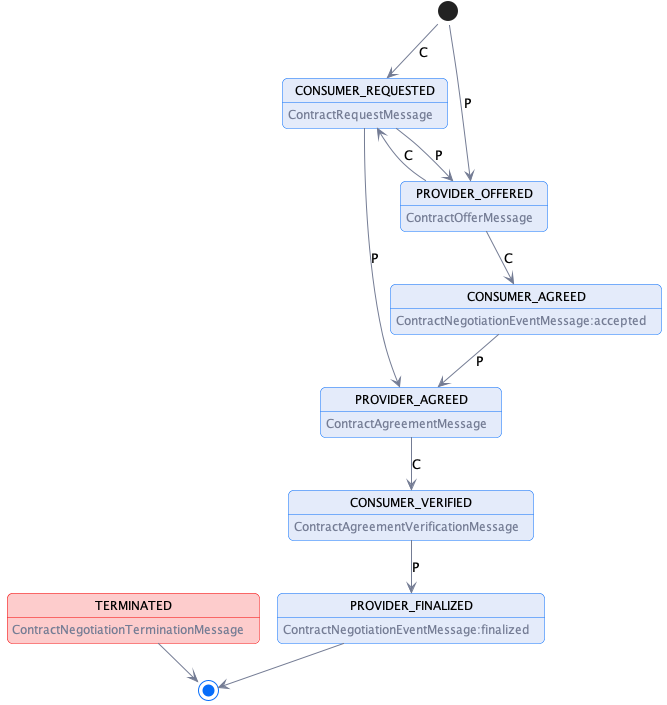

# Contract Negotiation Protocol

## Introduction: Terms

This document outlines the key elements of the contract negotiation protocol. The following terms are used:

- A _**message type**_ defines the structure of a _message_.
- A _**message**_  is an instantiation of a _message type_.
- The _**contract negotiation protocol**_ is the set of allowable message type sequences and is defined as a state machine (CNP-SM).
- A _**contract negotiation (CN)**_ is an instantiation of the CNP-SM.
- A _**provider**_ is a participant agent that offers an asset.
- A _**consumer**_ is a participant agent that requests access to an offered asset.

## Contract Negotiation Protocol

A contract negotiation (CN) involves two parties, a _provider_ that offers one or more assets under a usage policy and _consumer_ that requests assets. A CN progresses through
a series of states, which are tracked by the provider and consumer using messages. A CN transitions to a state in response to a message from the counter-party.

The CN states are:

- **CONSUMER_REQUESTED** - A contract for an asset has been requested by the consumer and the provider has sent an ACK response.
- **PROVIDER_OFFERED** - The provider has sent a contract offer to the consumer and the consumer has sent an ACK response.
- **CONSUMER_OFFERED** - The consumer has sent a contract offer to the provider and the provider has sent an ACK response.
- **CONSUMER_AGREED** - The consumer has accepted that latest contract offer and the provider has sent an ACK response.
- **PROVIDER_AGREED** - The provider has accepted that latest contract offer, sent an agreement to the consumer, and the consumer has sent an ACK response.
- **CONSUMER_VERIFIED** - The consumer has sent an agreement verification to the provider and the provider has sent an ACK response.
- **PROVIDER_FINALIZED** - The provider has sent a finalization message to the consumer and the provider has sent an ACK response. Data is now available to the consumer.
- **DECLINED** - The provider or consumer has declined the contract negotiation. This is a terminal state.
- **ERROR** - The provider or consumer has placed the contract negotiation in an error state. This is a terminal state.
- **CANCELLED** - The provider or consumer has placed the contract negotiation in an cancelled state. This is a terminal state.

### Contract Negotiation State Machine

The CN state machine is represented in the following diagram. Note that transitions to the ERROR or CANCELLED states may occur from any other state and are not shown for simplicty:

Transition marked with `C` indicate a message sent by the consumer, transitions marked with `P` indicate a provider message. Terminal states are final; the state machine may
not transition to another state.

## Message Types

The CN state machine is transitioned upon receipt and acknowledgement of a message. This section details those messages as abstract message types.

### Notes

- Concrete wire formats are defined by the protocol binding, e.g. HTTPS.
- The `OK` and `ERROR` response message types are empty body responses that are mapped onto a protocol such as HTTPS.
- All ODRL policy types (Offer, Agreement) must contain an ODRL UID that is a GUID.
- The ODRL Agreement must have a target property containing the asset id.

### 1. ContractRequestMessage

**Sent by**: Consumer

**Resulting State**: CONSUMER_REQUESTED

**Example**: [ContractRequestMessage](./message/contract.request.message.json)

**Response**: [ContractNegotiation](./message/contract.negotiation.json) containing the negotiation id or ERROR.

**Schema**: (xx)[]

#### Description

The _ContractRequestMessage_ is sent by a consumer to initiate a contract negotiation.

#### Notes

- The offer id refers to an existing one that was provided during the cataloging process.
- The dataset id is not technically required but included to avoid an error where the offer is associated with a different data set.
- `callbackAddress` is a URI indicating where messages to the consumer should be sent. If the address is not understood, the provider MUST return an UNRECOVERABLE error.

### 2. ContractOfferMessage

**Sent by**: Consumer or Provider

**Resulting State**: PROVIDER_OFFERED or CONSUMER_OFFERED

**Example**: [ContractOfferMessage](./message/contract.offer.message.json)

**Response**: OK or ERROR

**Schema**: (xx)[]

#### Description

The _ContractOfferMessage_ is sent by a consumer or provider to exchange a contract offer.

#### Notes

- The contract offer must include a target containing the dataset id.

### 3. ContractOfferEventMessage

**Sent by**: Consumer

**Resulting State**: CONSUMER_AGREED or DECLINED

**Example**: [ContractOfferEventMessage](./message/contract.offer.event.message.json)

**Response**: OK or ERROR

**Schema**: (xx)[]

#### Description

The _ContractOfferEventMessage_ is sent by a consumer when it accepts or declines a provider contract offer. The `eventType` property can be `accept` or `decline`. If the event
type is `accept`, the state machine is placed in the CONSUMER_AGREED state. If the event type is `decline` the state machine is placed in the OFFER_DECLINED terminal state.

### 5. ContractAgreementMessage

**Sent by**: Provider

**Resulting State**: PROVIDER_AGREED

**Example**: [ContractAgreementMessage](./message/contract.agreement.message.json)

**Response**: OK or ERROR

**Schema**: (xx)[]

#### Description

The _ContractAgreementMessage_ is sent by a provider when it agrees to a contract. It contains the contract agreement with the provider's signature.

### 6. ContractAgreementVerificationMessage

**Sent by**: Consumer

**Resulting State**: CONSUMER_VERIFIED

**Example**: [ContractAgreementVerificationMessage](./message/contract.agreement.verification.message.json)

**Response**: OK or ERROR

**Schema**: (xx)[]

#### Description

The _ContractAgreementVerificationMessage_ is sent by a consumer to verify the acceptance of a contract agreement. It contains the contract agreement with the consumer's signature.

### 7. ContractAgreementEventMessage

**Sent by**: Provider

**Resulting State**: PROVIDER_FINALIZED

**Example**: [ContractAgreementEventMessage](./message/contract.agreement.event.message.json)

**Response**: OK or ERROR

**Schema**: (xx)[]

#### Description

The _ContractAgreementEventMessage_ is sent by a provider. When the `eventType` property is set to `finalize`, a contract agreement has been finalized and the associated asset is
accessible. The state machine is transitioned to the PROVIDER_FINALIZED state. Other event types may be defined in the future.

It is an error for a consumer to send a contract agreement event to the provider.

Note that contract events are not intended for propagation of agreement state after a contract negotiation has entered a terminal state. It is considered an error for a provider to
send a contract agreement event after the negotiation state machine has entered the PROVIDER_FINALIZED state.

### 8. ContractNegotiationCancellationMessage

**Sent by**: Consumer or Provider

**Resulting State**: CANCELLED

**Example**: [CancelMessage](./message/contract.negotiation.cancellation.message.json)

**Schema**: (xx)[]

#### Description

The _ContractNegotiationCancellationMessage_ is sent by a consumer or provider indicating it has cancelled the negotiation.

#### Notes

- The CANCELLED and DECLINED states are separated as they may be handled differently. DECLINED indicates that an offer or request have not been accepted.
  A negotiation process with this state may need to be persisted for legal reasons. As transition change to CANCELLED can have other reasons (e.g., a
  negotiation process started by mistake). A connector's operator may want to clean its storage from cancelled negotiations after a defined period of time.

### 9. ContractNegotiationErrorMessage

**Sent by**: Consumer or Provider

**Resulting State**: ERROR

**Example**: [NegotiationErrorMessage](./message/contract.negotiation.error.message.json)

**Schema**: (xx)[]

#### Description

The _ContractNegotiationErrorMessage_ is sent by a consumer or provider indicating an error has occurred.

## Checksum Calculations

Checksums are calculated by creating the [[JWS/CT]](#references) of ...

## References

- [[JCS] JSON Canonicalization Scheme](https://www.ietf.org/archive/id/draft-jordan-jws-ct-08.html)
- [[JWS/CT] JWS Clear Text JSON Signature Option](https://www.ietf.org/archive/id/draft-jordan-jws-ct-08.html)
- [[JWS] JSON Web Signature](https://www.rfc-editor.org/rfc/rfc7797.html)

## JWS Clear Text JSON Signature Option

- Adopt JWS/CT, an extension to the JSON Web Signature (JWS) standard.
- Combines the detached mode of JWS with the JSON Canonicalization Scheme (JCS). Detached mode is when the payload section of the JWS is replaced
  by an empty string:  XXXX.PAYLOAD.YYYY becomes XXXX..YYYY. Detached mode is described in the JWS spec.
- Maintains Signed JSON data in JSON format.

