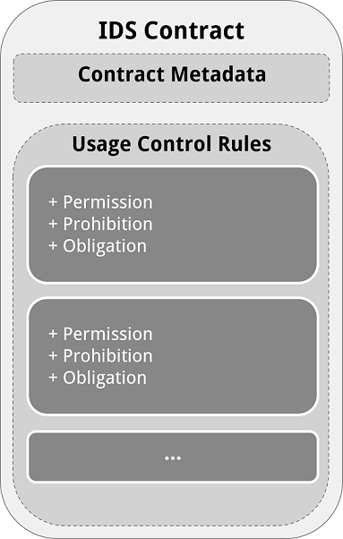
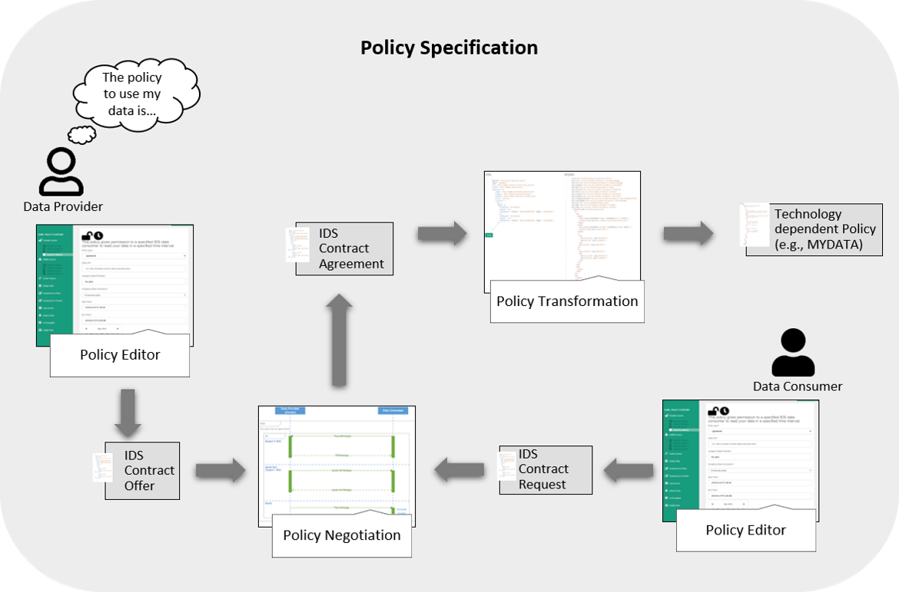

# IDS Usage Control Contract
## Usage Control Terms in IDS Contracts
An IDS Contract, also reffered to as IDS Policy, is *implicitly* divided to two main sections: the contract specific metadata and the *Usage Control Rules* of the contract.

The *IDS Usage Control Rules* are the key motive of organizational and technical Usage Control enforcement and address several Data Usage Control statements (e.g., permissions, prohibitions and obligations). An *IDS Contract* is specified in the *IDS Usage Control Language* which is the IDS technology independent language based on ODRL Policy Language.
## Usage Policy Specification

### Policy Classes
A Policy Class is an atomic policy template which refers to a specific restriction on Data Usage.
Here are a list of 21 Policy Classes:

**Restrict the usage of data to:**
 1. Data Consumer
 
This policy restricts the usage of the data to a specific Data Consumer, regardless of how many connectors they have and without any further usage restriction.

[Example for Policy Class 1: Restrict consumer - IDS](Policies/pc1-ids-restrict-consumer-example.json)

[Example for Policy Class 1: Restrict consumer - ODRL](Policies/pc1-odrl-restrict-consumer-example.json)

 2. IDS Connector
 
The Connector-restricted Data Usage policy restricts the usage of the data to a specific IDS connector of a specific Data Consumer assuming that the Data Consumer owns one or more IDS Connector(s).

[Example for Policy Class 2: Restrict connector - IDS](Policies/pc2-ids-restrict-connector-example.json)

[Example for Policy Class 2: Restrict connector - ODRL](Policies/pc2-odrl-restrict-connector-example.json)

3. Application inside a Connector

The Application-restricted Data Usage policy restricts the usage of the data to a specific application inside an IDS connector.

[Example for Policy Class 3: Restrict application - IDS](Policies/pc3-ids-restrict-application-example.json)

[Example for Policy Class 3: Restrict application - ODRL](Policies/pc3-odrl-restrict-application-example.json)

4. User Role

This policy restricts the usage of the data to a specific users (e.g. users with specific roles or users who are members of a specific organization, etc.). 

[Example for Policy Class 4: Restrict user (role) - IDS](Policies/pc4-ids-restrict-user-role-example.json)

[Example for Policy Class 4: Restrict user (role) - ODRL](Policies/pc4-odrl-restrict-user-role-example.json)

[Example (2) for Policy Class 4: Restrict user (role) - ODRL](pc4-odrl-restrict-user-role-example2.json)

5. Location of usage

The Location-restricted Data Usage policy restricts the usage of the data to a specific location. It may be expressed as names of areas or set of geographic points.

[Example for Policy Class 5: Restrict location of usage - IDS](Policies/pc5-ids-restrict-location-of-usage-example.json)

[Example for Policy Class 5: Restrict location of usage - ODRL](Policies/pc5-odrl-restrict-location-of-usage-example.json)

[Example (2) for Policy Class 5: Restrict location of usage - ODRL](pc5-odrl-restrict-location-of-usage-example2.json)

6. Purpose

The Purpose-restricted Data Usage policy restricts the usage of the data to specific purposes such as "marketing", "research", "Defect Analysis".

[Example for Policy Class 6: Restrict purpose - IDS](Policies/pc6-ids-restrict-purpose-example.json)

[Example for Policy Class 6: Restrict purpose - ODRL](Policies/pc6-odrl-restrict-purpose-example.json)

[Example (2) for Policy Class 6: Restrict purpose - ODRL](pc6-odrl-restrict-purpose-example2.json)

[Example (3) for Policy Class 6: Restrict purpose - ODRL](pc6-odrl-restrict-purpose-example3.json)

7. Event

The Event-restricted Data Usage policy restricts the usage of the data to specific events such as "Hannover Messe 2018" .

[Example for Policy Class 7: Restrict event - IDS](Policies/pc7-ids-restrict-event-example.json)

[Example for Policy Class 7: Restrict event - ODRL](Policies/pc7-odrl-restrict-event-example.json)

8. Security Level

The Security Level-restricted Data Usage policy restricts the usage of the data to a Specific IDS Connector when it is certified for a specified security level (i.e. *idsc:BASE_SECURITY_PROFILE*, *idsc:TRUST_SECURITY_PROFILE* and *idsc:TRUST_PLUS_SECURITY_PROFILE*).

[Example for Policy Class 8: Restrict security level - IDS](Policies/pc8-ids-restrict-security-level-example.json)

[Example for Policy Class 8: Restrict security level - ODRL](Policies/pc8-odrl-restrict-security-level-example.json)

9. Time Interval

The time interval-restricted Data Usage policy restricts the usage of the data to a specific time interval.

[Example for Policy Class 9: Restrict time interval - IDS](Policies/pc9-ids-restrict-time-interval-example.json)

[Example for Policy Class 9: Restrict time interval - ODRL](Policies/pc9-odrl-restrict-time-interval-example.json)

10. Duration

The Duration-restricted Data Usage policy restricts the usage of the data to a specific period.

[Example for Policy Class 10: Restrict duration - IDS](Policies/pc10-ids-restrict-duration-offer-example.json)

[Example for Policy Class 10: Restrict duration - ODRL](Policies/pc10-odrl-restrict-duration-offer-example.json)

11. Number of usage

This policy may be specified as “the Data Consumer is allowed to use my data not more than *n* times”.

[Example for Policy Class 11: Restrict number of usage - IDS](Policies/pc11-ids-restrict-number-of-usage-example.json)

[Example for Policy Class 11: Restrict number of usage - ODRL](Policies/pc11-odrl-restrict-number-of-usage-example.json)

12. Delete Data

This policy demands to delete data either immediately after it is used, or after a delay period or before a defined deadline.

[Example for Policy Class 12: Delete data - IDS](Policies/pc12-ids-delete-data-example.json)

[Example for Policy Class 12: Delete data - ODRL](Policies/pc12-odrl-delete-data-example.json)

[Example (2) for Policy Class 12: Delete data - ODRL](Policies/pc12-odrl-delete-data-example2.json)

13. Modify Data in Transit

This policy demands to intercept the data flow and modify the data in transit.

[Example for Policy Class 13: Modify data in transit - IDS](Policies/pc13-ids-modify-in-transit-example.json)

[Example for Policy Class 13: Modify data in transit - ODRL](Policies/pc13-odrl-modify-in-transit-example.json)

14. Modify Data in Rest

This policy demands to modify the data fields of a repository inside a connector.

[Example for Policy Class 14: Modify data in rest - IDS](Policies/pc14-ids-modify-in-rest-example.json)

[Example for Policy Class 14: Modify data in rest - ODRL](Policies/pc14-odrl-modify-in-rest-example.json)

15. Log Data Usage Information

This policy demands to log the Data Usage information either locally or on the Clearing House.

[Example for Policy Class 15: Log usage information - IDS](Policies/pc15-ids-log-usage-information-example.json)

[Example for Policy Class 15: Log usage information - ODRL](Policies/pc15-odrl-log-usage-information-example.json)

Note: A Policy Enforcement Point (PEP) intercepts the data flow and waits for an authorization decision from the Policy Decision Point (PDP). A Policy Execution Point (PXP) which is responsible to log the information could return a boolean value to the PDP and eventually influence the PEP. In a case that the Clearing House is not available, the PXP cannot execute the duty action and therefore it would return a False value to the PDP. Eventually, the PEP can block the data flow after receiving a usage deny from the PDP. A policy would specify such a case slightly different than what is shown above.

16. Inform a participant about the Data Usage

This policy demands to inform a participant (e.g. person, organization), or even the Clearing House about the Data Usage. For example, inform a party via Email or a notification system.

[Example for Policy Class 16: Notify participant - IDS](Policies/pc16-ids-notify-party-example.json)

[Example for Policy Class 16: Notify participant - ODRL](Policies/pc16-odrl-notify-party-example.json)

17. Pass a Policy to the Third-party

This policy demands to pass a policy to a third-party before distributing the data to them.

[Example for Policy Class 17: Next policy - IDS](Policies/pc17-ids-distribute-next-policy-example.json)

[Example for Policy Class 17: Next policy - ODRL](Policies/pc17-odrl-distribute-next-policy-example.json)

18. Artifact State

The Artifact state-restricted Data Usage policy restricts that the data is used (or distributed) when it is encrypted, anonymized, combined, etc.

[Example for Policy Class 18: Restrict artifact state - IDS](Policies/pc18-ids-restrict-artifact-state-example.json)

[Example for Policy Class 18: Restrict artifact state - ODRL](Policies/pc18-odrl-restrict-artifact-state-example.json)

19. Data Sale Contract

In this policy it is assumed that the payment has been done once.

[Example for Policy Class 18: Payment for sale - IDS](Policies/pc19-ids-restrict-payment-sale-example.json)

[Example for Policy Class 18: Payment for sale - ODRL](Policies/pc19-odrl-restrict-payment-sale-example.json)

[Example(2) for Policy Class 18: Payment for sale - ODRL](Policies/pc19-odrl-restrict-payment-sale-example2.json)

20. Data Rental Contract

In this policy it is assumed that the payment shall happen frequently (e.g. monthly)

[Example for Policy Class 19: Payment for rent - IDS](Policies/pc20-ids-restrict-payment-rent-example.json)

[Example for Policy Class 19: Payment for rent - ODRL](Policies/pc20-odrl-restrict-payment-rent-example.json)

[Example(2) for Policy Class 19: Payment for rent - ODRL](Policies/pc20-odrl-restrict-payment-rent-example2.json)

21. State

The State-restricted Data Usage policy restricts the usage of the data to specific environment state. For example, the data only can be used in an application when the firewall is activated.

[Example for Policy Class 21: Restrict state - IDS](Policies/pc21-ids-restrict-state-example.json)

[Example for Policy Class 21: Restrict state - ODRL](Policies/pc21-odrl-restrict-state-example.json)

**Usage Control Policy**
It is an identified policy that is a combination of one or more instances of the policy classes.
Example: "The Data Consumer X shall use my data not later than 30th of December 2022 and only for defect analysis purpose."

### Policy Editor
A policy editor or in XACML terminology a Policy Administration Point (PAP) supports data owners and data providers in specifying their usage restrictions. 
The [IDS Policy editor](https://odrl-pap.mydata-control.de/) comprises a Graphical User Interface and offers a Policy Specification guidance to the user.

### Policy Negotiation
A negotiation process takes care of the potential bargaining between a Data Provider and a Data Consumer regarding the usage conditions. An *Offer Contract* and a *Request Contract* are created by a Data Provider and a Data Consumer, respectively, and reflect their Data Usage requirements and demands. 
As a result of a Policy Negotiation process, it is expected that the involved parties reach an agreement. The corresponding *Agreement Contract* is specified in *IDS Usage Policy Language* and shall be enforced to their systems. 

More information: [Data Sovereignty: Updated Position Paper on Data Usage Control in the IDS](https://internationaldataspaces.org/data-sovereignty-updated-position-paper-on-data-usage-control-in-the-ids/)
### Policy Transformation
The technically enforceable rules shall be transformed to a technology dependent policy to facilitate the Usage Control enforcement of data sovereignty.
In order to support the Data Usage Control technologies, the policy transformation service is additionally added to the IDS Policy Editor. Currently, it supports the transformation to enforceable policies for the MY DATA Control Technologies. The support for other technologies and further extension will follow.

## Authors

| Name | Organization | Github |
|:---|:---|:---|
| Arghavan Hosseinzadeh          | Fraunhofer IESE | [Arghavan Hosseinzadeh](https://github.com/hosseinzadeha) |
| Robin Brandstädter             | Fraunhofer IESE | [Robin Brandstädter](https://github.com/Brandstaedter) |
