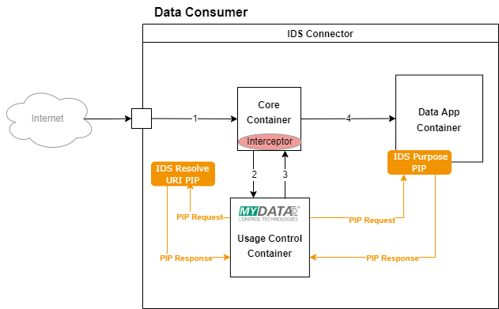
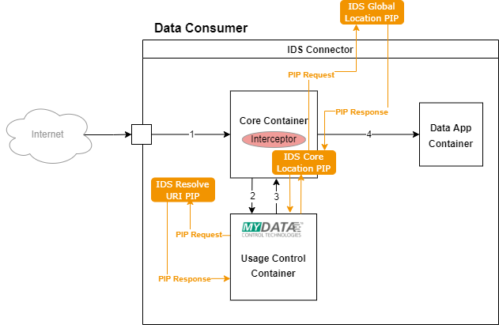

## Interfaces Standardization for Context Information (PIPs) and Actions to be Performed (PXPs)

In this chapter, we discuss the interfaces for the Policy Information Points (PIPs) and Policy Execution Points (PXPs) corresponding to the following cases (Policy Classes):

- Interfaces for the PIPs that provide information about the purpose
- Interfaces for the PIPs that provide information about the location of the connector
- Interfaces for the PIPs that provide information about the time and date
- Interfaces for the PXPs that execute the logging action

**Interfaces for the PIPs that provide information about the purpose**

In order to enforce a policy that restricts the usage of the data to a specific set of purposes, we need at least one PIP interface that is reachable by the Usage Control framework. We call this PIP an IDS Purpose PIP. A Data App securely provides information about the purposes of the usage via this PIP.

The detailed information about the **IDS Resolve URI PIP** is summarized here:

```
Interface description:

https://ids.example.com/pip/interface-description/purpose/list.json 

https://ids.example.com/pip/interface-description/purpose/list.ttl 

Java interface:

It returns a list of Data App's Purposes of usage.

List<Purpose> getAppPurpose()  or List<Purpose> getAppPurpose(String appURI)  

Endpoint:

[App-URI]/pip/purpose/list
```

[Remark: Ask Fraunhofer FIT for the existing App Interfaces/Self Description.]

Assuming that a policy restricts the usage of data to *Educational Use*, *Risk Management* and *Defect analysis* purposes and a Data App wants to use the data, the Usage Control app shall call the IDS Purpose PIP of that Data App and ask which purposes of usage that app has. when the PIP response *is equal or a subset of* the allowed purposes specified in the policy, then the UC App will permit the usage. The example policies are presented below:

```json
{
    "@context": [
        "http://www.w3.org/ns/odrl.jsonld",
        { "dc": "http://purl.org/dc/terms/",
        "ids":"https://w3id.org/idsa/core/",
        "idsc" : "https://w3id.org/idsa/code/" }
    ],
    "@type": "Agreement",
    "uid": "http://example.com/policy/restrict-by-purpose/12",
    "profile": "http://www.w3.org/ns/odrl/2/core",
    "dc:creator": "Data Provider 123",
    "dc:description": "The Purpose-restricted Data Usage policy restricts the usage of the data to specific purposes such as marketing, research, Defect Analysis, etc.",
    "dc:issued": "2022-05-19T12:00",
    "ids:provider": "http://example.com/ids/party/123",
    "ids:consumer": "http://example.com/ids/party/456",
    "permission": [{
        "target": "http://example.com/ids/data/789",
        "assigner": "http://example.com/ids/party/123",
        "assignee": "http://example.com/ids/party/456",
        "action": [ "read", "use" ],
        "constraint": [{
           "leftOperand": "purpose",
           "operator": "eq",
           "rightOperand": { "@value": "Research", "@type": "xsd:string" },
           "ids:pipEndpoint": [{
              "@type":"ids:PIP",
              "ids:interfaceDescription":{ "@value":"?interfaceURI", "@type":"xsd:anyURI" }, 
              "ids:endpointURI":{ "@value":"?endPointURI", "@type":"xsd:anyURI" } 
           }]
       }]
    }]
}
```

```json
{
    "@context": [
        "http://www.w3.org/ns/odrl.jsonld",
        { "dc": "http://purl.org/dc/terms/",
        "ids":"https://w3id.org/idsa/core/",
        "idsc" : "https://w3id.org/idsa/code/" }
    ],
    "@type": "Agreement",
    "uid": "http://example.com/policy/restrict-by-purpose/12",
    "profile": "http://www.w3.org/ns/odrl/2/core",
    "dc:creator": "Data Provider 123",
    "dc:description": "The Purpose-restricted Data Usage policy restricts the usage of the data to specific purposes such as marketing, research, Defect Analysis, etc.",
    "dc:issued": "2022-05-19T12:00",
    "ids:provider": "http://example.com/ids/party/123",
    "ids:consumer": "http://example.com/ids/party/456",
    "permission": [{
        "target": "http://example.com/ids/data/789",
        "assigner": "http://example.com/ids/party/123",
        "assignee": "http://example.com/ids/party/456",
        "action": [ "read", "use" ],
        "constraint": [{
           "leftOperand": "purpose",
           "operator": "isAnyOf",
           "rightOperand": [{ "@value": "Educational Use", "@type": "xsd:string" },
                            { "@value": "Risk Management", "@type": "xsd:string" },
                            { "@value": "Defect Analysis", "@type": "xsd:string" }]
           "ids:pipEndpoint": [{
              "@type":"ids:PIP",
              "ids:interfaceDescription":{ "@value":"?interfaceURI", "@type":"xsd:anyURI" }, 
              "ids:endpointURI":{ "@value":"?endPointURI", "@type":"xsd:anyURI" } 
           }]
       }]
    }]
}
```

There might be a case that a *RightOperandReference* is used in the policy, instead of the *RightOperand*. The [Information Model of ODRL Language](https://www.w3.org/TR/odrl-model/#constraint-class) defines the *rightOperandReference* as follows:

>The rightOperandReference represents an IRI that MUST be de-referenced first to obtain the actual value of the rightOperand.

```json
{
    "@context": [
        "http://www.w3.org/ns/odrl.jsonld",
        { "dc": "http://purl.org/dc/terms/",
        "ids":"https://w3id.org/idsa/core/",
        "idsc" : "https://w3id.org/idsa/code/" }
    ],
    "@type": "Agreement",
    "uid": "http://example.com/policy/restrict-by-purpose/12",
    "profile": "http://www.w3.org/ns/odrl/2/core",
    "dc:creator": "Data Provider 123",
    "dc:description": "The Purpose-restricted Data Usage policy restricts the usage of the data to specific purposes such as marketing, research, Defect Analysis, etc.",
    "dc:issued": "2022-05-19T12:00",
    "ids:provider": "http://example.com/ids/party/123",
    "ids:consumer": "http://example.com/ids/party/456",
    "permission": [{
        "target": "http://example.com/ids/data/789",
        "assigner": "http://example.com/ids/party/123",
        "assignee": "http://example.com/ids/party/456",
        "action": [ "read", "use" ],
        "constraint": [{
           "leftOperand": "purpose",
           "operator": "eq",
           "rightOperandReference": { "@value": "?ReferenceToAllowedPurposes", "@type": "xsd:anyURI" },
           "ids:pipEndpoint": [{
              "@type":"ids:PIP",
              "ids:interfaceDescription":{ "@value":"?interfaceURI", "@type":"xsd:anyURI" }, 
              "ids:endpointURI":{ "@value":"?endPointURI", "@type":"xsd:anyURI" } 
           }]
       }]
    }]
}
```

In such a case, UC app needs to resolve the URI a retrieve the actual allowed purposes first before enforcing the policy. The image below shows that the UC app can call a certified service called IDS Resolve URI PIP to take care of this issue.



The IDS Resolve URI PIP can be located inside or outside of the Connector. For the sake of security, the IDS Purpose PIP (as part of the Data App) shall not communicate with outside of the Connector to exchange information. Therefore, the IDS Purpose PIP only communicates with the UC app. 

The detailed information about the **IDS Resolve URI PIP** is summarized here:

```
Interface description:

https://ids.example.com/pip/interface-description/purpose/uri

Java interface:

It receives the URI that is specified as a value for the RightOperandreference in the policy and returns a list of Purposes that are allowed.

List<Purpose> resolvePurpose(String rightOperandReferenceURI)

Endpoint:

[App-URI]/pip/purpose/uri (skip external resolver from core) 
```

**Interfaces for the PIPs that provide information about the location of the connector**

In order to enforce a policy that restricts the usage of data to the location of the Connector, we need at least one PIP that knows the location of the Connector and also, computes a *part of* function. The *part of* function is responsible to check whether one location (e.g., city) is within the area of another location (e.g., country) or not. In the previous case, for computing the *subset* function, a PDP can compute whether a set (i.e., list) is in another set (i.e., list). But in this case, since checking the area of a location is complicated, we shift this responsibility to a PIP.

A sample Connector location restricted policy specified in ODRL core language looks like this:

```json
{
    "@context": [
        "http://www.w3.org/ns/odrl.jsonld",
        { "dc": "http://purl.org/dc/terms/",
        "ids":"https://w3id.org/idsa/core/",
        "idsc" : "https://w3id.org/idsa/code/" }
    ],
    "@type": "Agreement",
    "uid": "http://example.com/policy/restrict-location/12",
    "profile": "http://www.w3.org/ns/odrl/2/core",
    "dc:creator": "Data Provider 123",
    "dc:description": "The Location-restricted Data Usage policy restricts the usage of the data to a specific location. It may be expressed as names of areas or set of geographic points.",
    "dc:issued": "2022-05-19T12:00",
    "ids:provider": "http://example.com/ids/party/123",
    "ids:consumer": "http://example.com/ids/party/456",
    "permission": [{
        "target": "http://example.com/ids/data/789",
        "assigner": "http://example.com/ids/party/123",
        "assignee": "http://example.com/ids/party/456",
        "action": "use",
        "constraint": [{
           "leftOperand": "spatial",
           "operator": "eq",
           "rightOperand": { "@value": "http://ontologi.es/place/DE", "@type": "xsd:anyURI" },
           "ids:pipEndpoint": [{
              "@type":"ids:PIP",
              "ids:interfaceDescription":{ "@value":"?interfaceURI", "@type":"xsd:anyURI" }, 
              "ids:endpointURI":{ "@value":"?endPointURI", "@type":"xsd:anyURI" } 
           }]
       }]
    }]
}
```

Similar to the previous case, a *RightOperandReference* and therefore, an **IDS Resolve URI PIP** can be used. Following is a sample policy for this case:

```json
{
    "@context": [
        "http://www.w3.org/ns/odrl.jsonld",
        { "dc": "http://purl.org/dc/terms/",
        "ids":"https://w3id.org/idsa/core/",
        "idsc" : "https://w3id.org/idsa/code/" }
    ],
    "@type": "Agreement",
    "uid": "http://example.com/policy/restrict-location/12",
    "profile": "http://www.w3.org/ns/odrl/2/core",
    "dc:creator": "Data Provider 123",
    "dc:description": "The Location-restricted Data Usage policy restricts the usage of the data to a specific location. It may be expressed as names of areas or set of geographic points.",
    "dc:issued": "2022-05-19T12:00",
    "ids:provider": "http://example.com/ids/party/123",
    "ids:consumer": "http://example.com/ids/party/456",
    "permission": [{
        "target": "http://example.com/ids/data/789",
        "assigner": "http://example.com/ids/party/123",
        "assignee": "http://example.com/ids/party/456",
        "action": "use",
        "constraint": [{
           "leftOperand": "spatial",
           "operator": "eq",
           "rightOperandReference": { "@value": "?referenceToAllowedLocations", "@type": "xsd:anyURI" },
           "ids:pipEndpoint": [{
              "@type":"ids:PIP",
              "ids:interfaceDescription":{ "@value":"?interfaceURI", "@type":"xsd:anyURI" }, 
              "ids:endpointURI":{ "@value":"?endPointURI", "@type":"xsd:anyURI" } 
           }]
       }]
    }]
}
```

A location information can be represented in various ways; Geonames, Geopoints, etc. 

In order to refer to a location by Geonames, we could use several standards such as [ISO 3166-1](https://www.iso.org/standard/72482.html), [ISO 3166-2](https://www.iso.org/standard/72483.html), [Geonames](https://www.geonames.org/) and [DBpedia](https://www.dbpedia.org/). 



The local IDS Location PIP is located in the Core. It has the responsibility to provide the IP of the Connector. It may resolve the Location URI or the Geographic points from the IP itself and compute whether the location of the Connector is *part of* the permitted location (given by the policy) or not. In order to shift the evaluation overload from the Core to outside of the Connector and also, to provide this service globally in the dataspace (i.e., available for all Usage Control frameworks), we recommend to use a certified IDS Global Location PIP that receives the IP of the Connector, retrieves the locations and computes the *part of* function. Using this Global PIP, its Interface Description can be known to the Data Provider in advance.

We define identical interface descriptions for the interfaces of **IDS Global Location PIP** and **IDS Core Location PIP**. The detailed information about them is summarized here:

```
Interface descriptions:

https://ids.example.com/pip/interface-description/location/geoname/geonames
https://ids.example.com/pip/interface-description/location/geopoints/geopoints 
https://ids.example.com/pip/interface-description/location/ip/geonames 
https://ids.example.com/pip/interface-description/location/ip/geopoints 
https://ids.example.com/pip/interface-description/location/cert/geonames 
https://ids.example.com/pip/interface-description/location/cert/geopoints 

Java interfaces:

Boolean isPartOf(location,location)
Boolean isPartOf(geopoints,geopoints)
Boolean isPartOf(ip,location)
Boolean isPartOf(ip,geopoints)
Boolean isPartOf(cert,location)
Boolean isPartOf(cert,geopoints)

Note that the IP could be empty or null for IDS Core Location PIP because core has to determine it.

IPaddress getIp() 

Cert getCert() 

GeoPoint getLongLat() 
```


**Interfaces for the PIPs that provide information about the time and date**

In order to enforce a policy that restricts the data usage to a specific time interval, we need to have a PIP to resolve the current date and time in the right time zone.

A corresponding policy specified in ODRL core language is shown here:

```json
{
    "@context": [
        "http://www.w3.org/ns/odrl.jsonld",
        { "dc": "http://purl.org/dc/terms/",
        "ids":"https://w3id.org/idsa/core/",
        "idsc" : "https://w3id.org/idsa/code/" }
    ],
    "@type": "Agreement",
    "uid": "http://example.com/policy/restrict-time-interval/12",
    "profile": "http://www.w3.org/ns/odrl/2/core",
    "dc:creator": "Data Provider 123",
    "dc:description": "The time interval-restricted Data Usage policy restricts the usage of the data to a specific time interval.",
    "dc:issued": "2022-05-19T12:00",
    "ids:provider": "http://example.com/ids/party/123",
    "ids:consumer": "http://example.com/ids/party/456",
    "permission": [{
        "target": "http://example.com/ids/data/789",
        "assigner": "http://example.com/ids/party/123",
        "assignee": "http://example.com/ids/party/456",
        "action": "use",
        "constraint": [{
           "leftOperand": "dateTime",
           "operator": "gteq",
           "rightOperand": { "@value": "2022-06-01T08:00Z", "@type": "xsd:dateTimeStamp" },
           "ids:pipEndpoint": [{
              "@type":"ids:PIP",
              "ids:interfaceDescription":{ "@value":"?interfaceURI", "@type":"xsd:anyURI" }, 
              "ids:endpointURI":{ "@value":"?endPointURI", "@type":"xsd:anyURI" }
           }]
       },{
           "leftOperand": "dateTime",
           "operator": "lteq",
           "rightOperand": { "@value": "2022-10-01T08:00Z", "@type": "xsd:dateTimeStamp" },
           "ids:pipEndpoint": [{
              "@type":"ids:PIP",
              "ids:interfaceDescription":{ "@value":"?interfaceURI", "@type":"xsd:anyURI" }, 
              "ids:endpointURI":{ "@value":"?endPointURI", "@type":"xsd:anyURI" } 
           }]
       }]
    }]
}
```

When there is an Endpoint given, then that PIP must be called. Otherwise, the default certified implementation of the Usage Control framework is sufficient. In such a case, a standard protocol like NTP (de.pool.ntp.org servers for Germany) could be used.

```
Interface description:

https://ids.example.com/pip/interface-description/time/zoneid

Java interface:

It receives a ZoneID value and returns the current date and time in the format of DateTimeStamp.

DateTimeStamp getTime(ZoneID)

```

**Interfaces for the PXPs that execute the logging action**

A PXP executes an action that is demanded by the policy. A policy may demand logging the usage information. It can be sufficient that only the Clearing House logs the usage information. However, a Data Provider may demand an additional service for the logging action. In such a case, the *idsc:SYSTEM_DEVICE* represents a computing system that is responsible for logging. An example policy comes as follows:

```json
{
    "@context": [
        "http://www.w3.org/ns/odrl.jsonld",
        { "dc": "http://purl.org/dc/terms/",
        "ids":"https://w3id.org/idsa/core/",
        "idsc" : "https://w3id.org/idsa/code/" }
    ],
    "@type": "Agreement",
    "uid": "http://example.com/policy/log-usage-information/42",
    "profile": "http://www.w3.org/ns/odrl/2/core",
    "dc:creator": "Data Provider 123",
    "dc:description": "This policy demands to log the Data Usage information either locally or on the Clearing House.",
    "dc:issued": "2022-05-19T12:00",
    "ids:provider": "http://example.com/ids/party/123",
    "ids:consumer": "http://example.com/ids/party/456",
    "permission": [{
        "target": "http://example.com/ids/data/789",
        "assigner": "http://example.com/ids/party/123",
        "assignee": "http://example.com/ids/party/456",
        "action": "use",
        "duty": [{
           "action": [{
              "rdf:value": { "@id": "idsc:log" },
              "includedIn": "inform",
              "refinement": [{
                 "leftOperand": "systemDevice",
                 "operator": "eq",
                 "rightOperand": { "@value": "?loggingServer", "@type": "xsd:anyURI" }
              },{
                 "leftOperand": "idsc:LOG_LEVEL",
                 "operator": "eq",
                 "rightOperand": { "@value": "idsc:ON_ALLOW", "@type": "xsd:string" }
              }]
           }],
           "constraint": [{
               "leftOperand": "event",
               "operator": "gt",
               "rightOperand": { "@id": "odrl:policyUsage" }
           }],
           "ids:pxpEndpoint": [{
              "@type":"ids:PXP",
              "ids:interfaceDescription":{ "@value":"?interfaceURI", "@type":"xsd:anyURI" }, 
              "ids:endpointURI":{ "@value":"?endPointURI", "@type":"xsd:anyURI" } 
           }]
        }]
    }]
}
```

and here is the interface description of an **IDS Log PXP**:

```
Interface description

https://ids.example.com/pxp/interface-description/log/simple   

Parameters:

ConnectorID, AssetID, Action,Timestamp

Endpoint (also as system device attribute):

http://ids.example.com/pxp/simple-log

```
